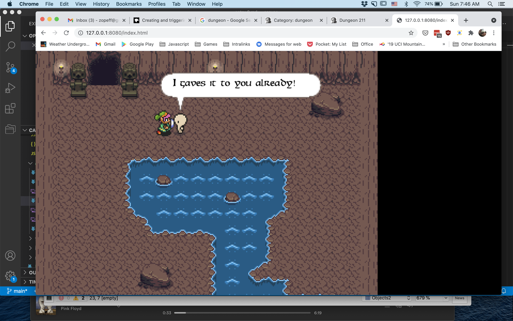
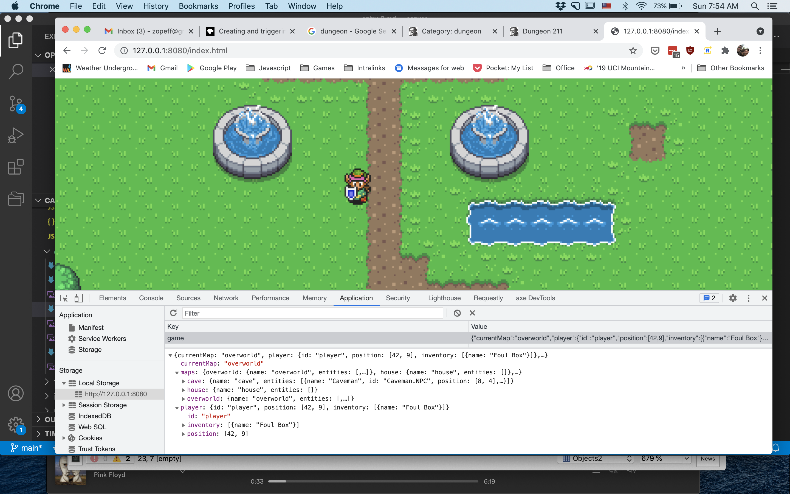

8/22/21
I spent yesterday finishing up the different NPC code for the new "Quest". To keep things interesting and to give me something to work towards I've come up wiht a basic quest that you need to intereact with the NPCs for. This first quest looks like this:
* talk to npc
* npc tells you 
    * (a) something bad lives in the cave and to kill it
    * (a) something bad lives in the cave stole a rare item
* go to cave
* (kill monster)?
* retrieve rare item
* return to first npc
* win

_So basically, NPC1 wants a thing, NPC2 has the thing, bring thing back to NPC1._

I felt this gave me enough to work with for the state machine and questing status. It would also make use of the speech bubbles and NPC state classes/loading that I just recently added. What I didnt exactly forsee was that this would also force me to add inventory, and saving/loading the game state. 

There is not much to see when it comes to the interaction you have with the various NPCs right now, I will need to expand the speech bubbles and add a more complex dialog engine for that. You can get basic indicators that you have spoken to the NPC and, internally at least, they have updated status checks to know before/durring/after the actual quest.

The state machine aspect of this was kinda bothering me, and I'm still not completely happy with it. In my mind the main NPC has an idle/speak state that they do while just waiting for the player to interact with them. Then after the player gets the quest, the NPC should be in a "waiting" state for the quest to complete, but the "waiting" then means they wouldnt be able to do do the idle/speak routine since an FSM can only be in 1 state at a time. To push past this, I just added a few flags in the state machine to keep track of those states - waiting and quest compelte. I think maybe these can just be moved to a "Quest" FSM and moe the whole thing to a more structured approach.

Anyway, we now have 2 named NPCs - Foul Ole Ron, and Caveman. Ron needs an item the Caveman stole and to complete the quest you first talk to Ron, then go into the cave, Caveman gives you the box, and you can return to Ron to complete the quest. This simple thing was actually super helpful in teasing out all the missing parts like saving/loading. Which, I didnt really anticipate needing this early, but, since the caveman is on a different map, and the entities are local to the map, I needed the ability to load the cave then return to the overworld *and* still have Ron remember that he sent me on the quest in the first place. So, while, it was a bit of extra work, I'm pretty happy where the system is now and can even save/load the entire game state (probably to be refactored later).

Finnally, something I'm really happy with right now is also something I didnt expect. My workflow has been to jot down ideas on the todo.md file first. Just basic bullets with no detail. Then, pick one item, and implement the basics. In doing this I usually end up rewriting and refactoring a lot of code in the process. What is most interesting about this is that in my normal work, this kind of refactoring is usually treated as todo items in and of themselves and we get lost in the tasks rather the goal. This model here is so focused on the goal and the todos are small, that each todo could be an agile 'increment'. I would love to work like this at work someday...

Whelp, there is a hurricane coming so with 2 days of rain and being trapped inside, I'm sure I'll have lots of updates coming!