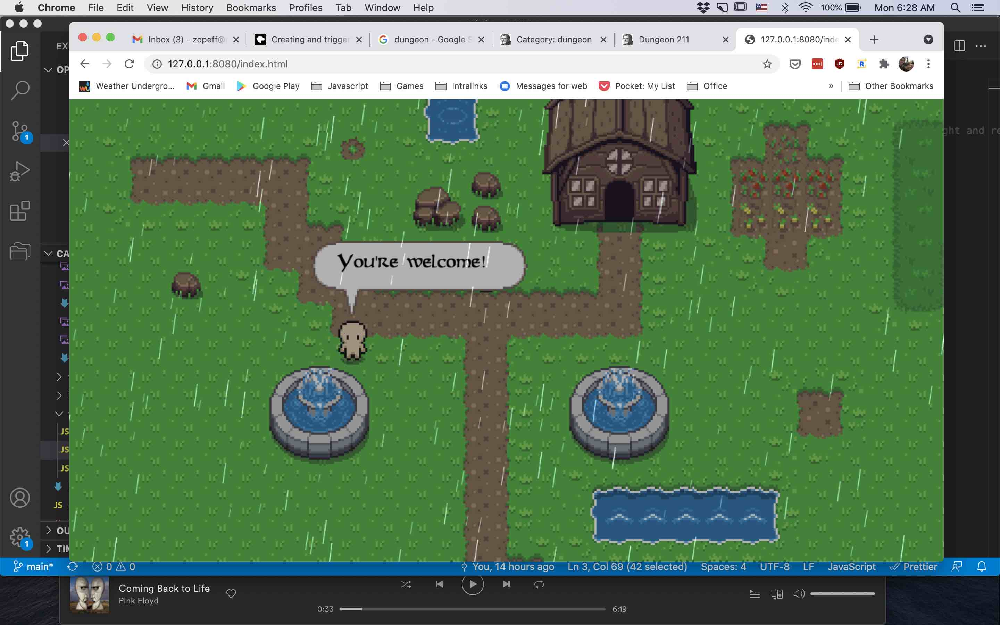
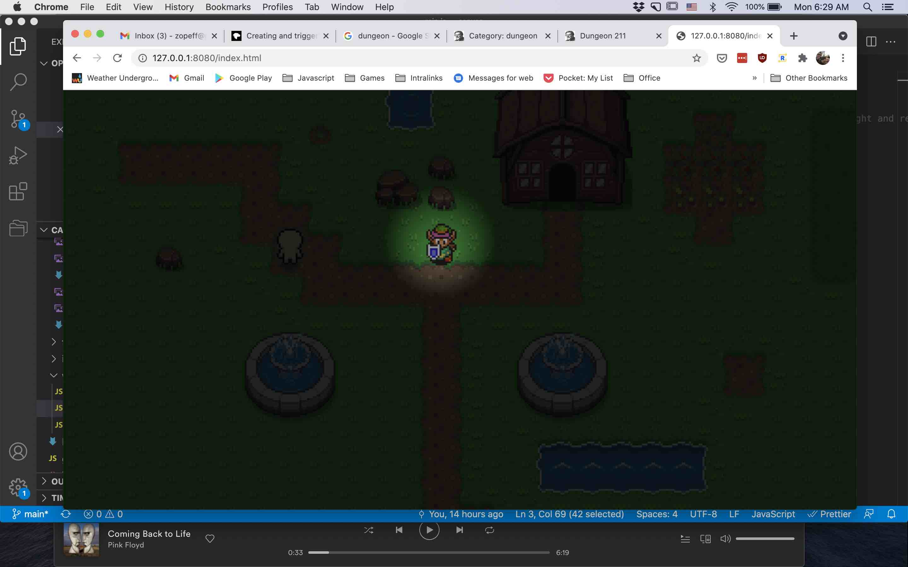
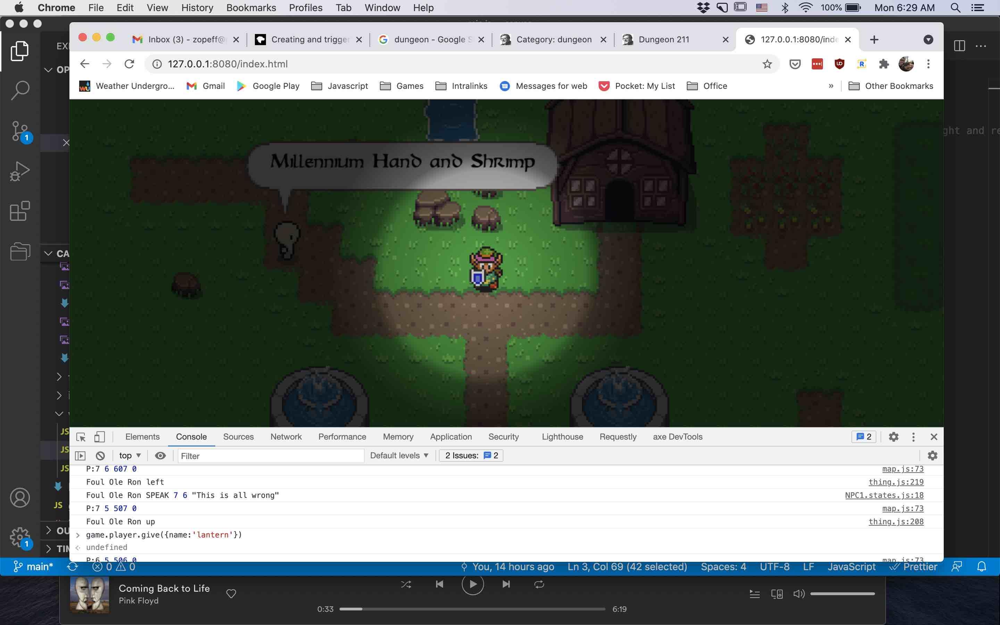

8/22/21
weather?

weather!

Wasnt super interested in continuing with the quest mechanics this morning, and with a hurricane blowing through, I figured maybe try working on some environmental effects. After the normal farting around with housekeeping stuff like the _todo_ and small code futzes I started looking on line to find an example of rain I could use.

At first I found this: https://codepen.io/arickle/pen/XKjMZY and after an hour or so of fiddling I had it up and running in game. It wasnt great though. The mixing of canvas and this effect in pure CSS was a little tricky to get going at first, and because it was pure CSS I was having trouble getting it looking exactly how i wanted.

Second attemp I looked for something implemented in canvas itself and stumbled upon this site: http://www.geoffblair.com/blog/rain-effect-html5-canvas/. This fit what I was looking for almost exactly. The only thing missing is the little spatter effect of a drop hitting the ground (that is something i added to the todo list). It took a bit of fiddling but got it up and working pretty quick and it was pretty much exactly what I wanted.

A few minutes later and I had it wired up into the game engine but it still felt like there was something else I could do.... Nighttime!

Night was an idea I had a while back also and it had an interesting tie in with items. I figured a 'lantern' might be able to interact with the night and make it not so dark. This would also be useful in the cave. So fresh of the rain, I refactored the weather object i had created into more of a controller that could also add the night effect. 

Now, there is day, night 
and rain with night and rain able to happen at the same time! Oh and the item named 'lantern' makes the halo around the player a little bit more bright:

Next up, I think I'll go back to the dialog system and finish off the questing so that it feels more complete.
